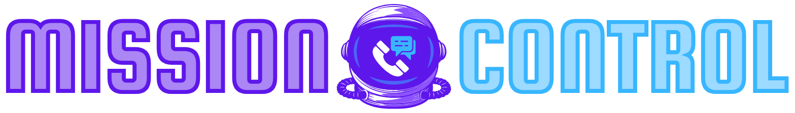

# Mission Control




[Mission Control](https://calltheory.com/mission-control) is a web-based utility dashboard for [Amtelco](https://callcenter.amtelco.com) call center environments created by [Call Theory](https://calltheory.com).


## No Amtelco Affiliation

Mission Control is an unofficial community project and is not endorsed, sponsored, or otherwise affiliated with [Amtelco](https://www.amtelco.com). All Amtelco trademarks, service marks, trade names, logos, domain names, and any other features of the Amtelco brand are the sole property of Amtelco or its licensors.

## Requirements

Based on the [Laravel Framework](https://laravel.com), you'll need:

- PHP 8.4+
- Composer 2+
- Node.js 18+
- A [compatible database](https://laravel.com/docs/12.x/database)

You'll also need the following system libraries:

- `sox`
- `lame`
- `sox-mp3-format`

```bash
# Debian/Ubuntu
sudo apt install sox lame libsox-fmt-mp3
```

## Installation

```bash
# Clone the repository
git clone https://github.com/calltheory/mission-control.git

# Move into the repository
cd mission-control

# Install PHP dependencies
composer install

# Install JavaScript dependencies
npm install

# Install headless browser for screenshots
npx puppeteer browsers install chrome-headless-shell

# Build assets
npm run build

# Copy the environment file
cp .env.example .env

# Generate application key
php artisan key:generate

# You should probably modify the .env file 
# for your environment at this point

# Run migrations
php artisan migrate

# Setup public storage link
php artisan storage:link
```

## Development

In local environments, you can use [Laravel Sail](https://laravel.com/docs/12.x/sail)

```bash
# Start docker container using sail
vendor/bin/sail up -d

# Instead of `php artisan migrate`
vendor/bin/sail artisan migrate
```

> You can (and should) also [create a shell alias for sail](https://laravel.com/docs/12.x/sail#configuring-a-shell-alias)

For any normal artisan command that interacts with a cache or database, you'll want to use `sail` in place of `php` so the command runs in the testing environment. 

```bash
sail artisan storage:link
sail artisan migrate
sail artisan horizon
# etc...
```

## Production Deployment

### Chrome/Puppeteer Requirements

Mission Control uses Chrome/Puppeteer for screenshot generation features (People Praise API, board check exports). You must install Chrome in your production environment:

#### Docker/Container Deployments

Add to your production Dockerfile:

```dockerfile
# Option 1: Install Google Chrome
RUN apt-get update && apt-get install -y \
    wget \
    gnupg \
    && wget -q -O - https://dl-ssl.google.com/linux/linux_signing_key.pub | apt-key add - \
    && echo "deb http://dl.google.com/linux/chrome/deb/ stable main" >> /etc/apt/sources.list.d/google.list \
    && apt-get update \
    && apt-get install -y google-chrome-stable \
    && apt-get clean

# Option 2: Use Puppeteer's Chrome (recommended)
RUN npx puppeteer browsers install chrome-headless-shell
```

#### Traditional Server Deployments

```bash
# Option 1: Install Google Chrome
sudo apt-get update
sudo apt-get install -y google-chrome-stable

# Option 2: Use Puppeteer's Chrome (recommended)
npx puppeteer browsers install chrome-headless-shell
```

#### Environment Configuration

If Chrome isn't auto-detected, set the path in your `.env` file:

```env
# For Google Chrome
BROWSERSHOT_CHROME_PATH=/usr/bin/google-chrome-stable

# For Puppeteer's Chrome (path varies by system)
BROWSERSHOT_CHROME_PATH=/home/user/.cache/puppeteer/chrome-headless-shell/linux-*/chrome-headless-shell-linux64/chrome-headless-shell
```

Without Chrome installed, screenshot generation features will fail in production.

## Testing

Run the test suite:

```bash
# Sail/docker environments
sail artisan test

# Non-sail/docker environments
# php artisan test
```

## Contributing

Please read [CONTRIBUTING.md](CONTRIBUTING.md) for details on our code of conduct and the process for submitting pull requests.

## Security

Please report any security-related issues to [security@calltheory.com](mailto:security@calltheory.com) instead of using the issue tracker. See [SECURITY.md](SECURITY.md) for additional information.

## License

This project is licensed under the MIT License — see the [LICENSE](LICENSE) file for details.

## Documentation

Please see the latest documentation at [learn.calltheory.com/mission-control](https://learn.calltheory.com/mission-control)
