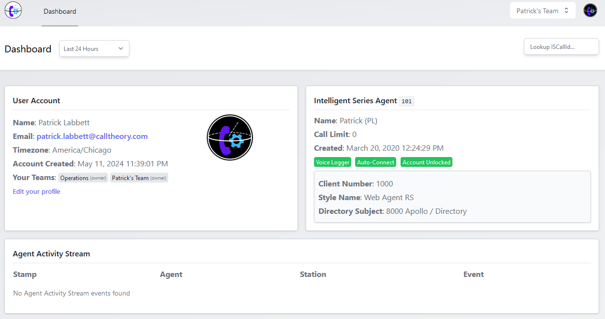
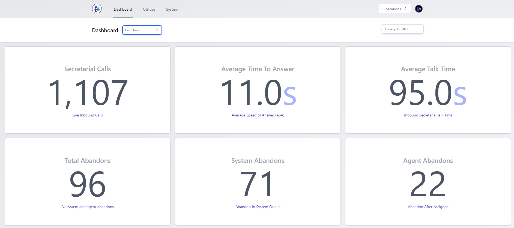

# Dashboard

There are two dashboards available, depending on the team you are part of. 

- **Personal Dashboard**: This is the default dashboard you see when you log in the first time. It shows you the most recent calls, messages, and other events that are relevant to you.
- **Team Dashboard**: This is the dashboard you see when you switch to a team. It highlights team-wide aggregated metrics based on your team settings.

You can toggle between the personal and team dashboard of your choice by using the Team Switcher in the top right corner of the screen.

## Personal Dashboard

The personal dashboard provides a simple information display with the following elements:

### User Account Details

- Name
- Email
- Timezone
- Account Created Date
- Teams
- Profile Link

### Intelligent Series Agent

> This feature requires that your administrator assigns your Intelligent Series agtId properly in team settings.

- Agent ID (agtId)
- Agent Name and Initials
- Agent Created Date
- Voice Logger enabled
- Auto-Connect enabled
- Account Locked/Unlocked
- Default Client Number ("Home Account")
- Currently assigned Web Agent Style
- Default Directory Subject

### Agent Activity Stream

A combined event stream of the statAgentCalls and statAgentTracker events.

- Stamp of Event
- Agent involved (your assigned agent)
- Station Type and Number
- Event Details

> You can adjust the timeframe from the Timeframe dropdown at the top left of the dashboard.

## Team Dashboard

The team dashboard provides an aggregate display of statistics for your team. It includes the following elements:

- Secretarial Calls
- Average Time To Answer
- Average Talk Time
- Total Abandons
- System Abandons
- Agent Abandons
- Abandon Rate
- Average Disconnect Time
- Greeting Hangups

> You can adjust the timeframe from the Timeframe dropdown at the top left of the dashboard.
