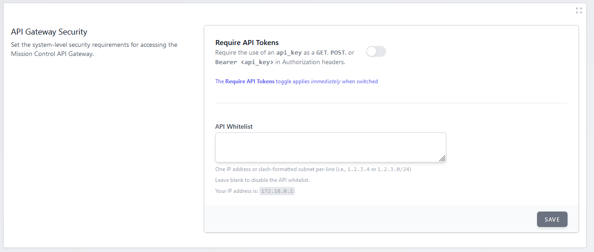

# API Gateway

Secure access to your Mission Control API by API tokens or IP white lists.



You can use both the API whitelist and the API tokens to secure your API access.

## Require API Tokens

API tokens are created by individual users and are used to authenticate API requests.
Generate one at `/user/api-tokens` — click the user icon in the top right corner, then
**API Tokens**.

Send the token as a bearer token in the `Authorization` header:

```
Authorization: Bearer <api_key>
Accept: application/json
```

Set the `Accept` header as well, so that errors come back as JSON rather than HTML.

> Query-string and form-field API keys are not accepted on these endpoints. If you need to
> authorize a caller that cannot set a header, use the API whitelist below instead.

## API Whitelist

Enter an IP address or network in /CIDR format to enable the whitelist - **_one per-line_**. 

> This feature support both IPv4 and IPv6 addresses/networks.

Assuming a well-behaved proxy, we will use the `X-Forwarded-*` family of headers to determine the client's IP address.
